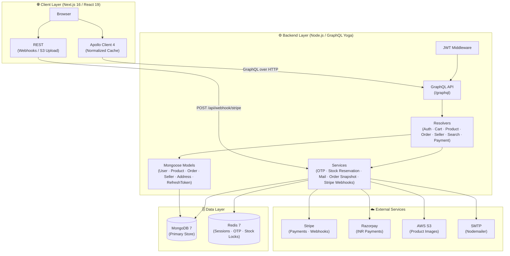
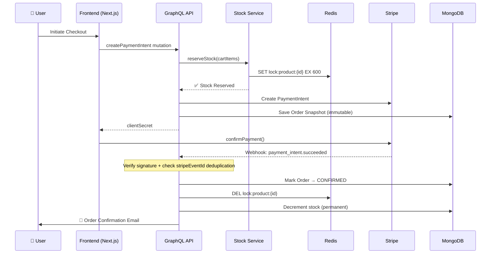
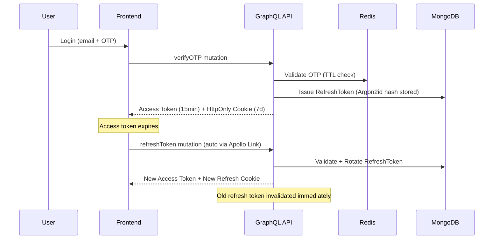

<div align="center">


<br/>

[](https://nextjs.org/)
[](https://react.dev/)
[](https://www.typescriptlang.org/)
[](https://the-guild.dev/graphql/yoga-server)
[](https://mongoosejs.com/)
[](https://redis.io/)
[](https://stripe.com/)
[](https://aws.amazon.com/s3/)
[](https://www.docker.com/)
[](LICENSE)

<br/>

> **A production-grade, full-stack multi-vendor e-commerce platform built on a high-performance monorepo architecture.**
> Zynora delivers a seamless buying and selling experience — from dynamic storefronts to atomic inventory management and real-time payment orchestration.

<br/>

[🚀 View Live Demo](#) &nbsp;·&nbsp; [🐛 Report Bug](https://github.com/AnkitShukla2405/Zynora/issues) &nbsp;·&nbsp; [⭐ Star on GitHub](https://github.com/AnkitShukla2405/Zynora) &nbsp;·&nbsp; [👔 Connect on LinkedIn](https://www.linkedin.com/in/ankitshukladev)

<br/>

</div>

---

## 📖 Table of Contents

- [🎯 Why Zynora Stands Out](#-why-zynora-stands-out)
- [🛠️ Tech Stack](#️-tech-stack)
- [🏗️ System Architecture](#️-system-architecture)
- [✨ Core Features](#-core-features)
- [🔐 Security & Performance](#-security--performance)
- [🗄️ Database Design](#️-database-design)
- [📡 API Reference](#-api-reference)
- [⚙️ Getting Started](#️-getting-started)
- [📁 Project Structure](#-project-structure)
- [🔮 Roadmap](#-roadmap)
- [👨‍💻 About the Author](#-about-the-author)

---

## 🎯 Why Zynora Stands Out

> This isn't a CRUD app with a payment button bolted on.

Modern e-commerce platforms suffer from three fundamental problems: **monolithic architectures that don't scale**, **fragile payment flows that lose revenue**, and **poor seller tooling that drives vendors away**. **Zynora was engineered to solve all three.**

Here is a breakdown of the hardest engineering challenges solved:

| 🔥 Challenge | 💡 Solution Implemented |
|:---|:---|
| **Race conditions on stock** | Atomic Redis-backed stock reservation with TTL locks — prevents overselling across concurrent checkouts |
| **Secure token rotation** | Argon2id-hashed refresh tokens stored in MongoDB + Redis; token replay attacks are structurally impossible |
| **OTP brute-force prevention** | Rate-limited OTP service with configurable Redis TTL for fully stateless session validation |
| **Order integrity** | Immutable **order snapshot service** — price & seller info captured atomically at purchase time, decoupled from future catalog edits |
| **Webhook idempotency** | Stripe webhook handler with `stripeEventId` deduplication — no double-processing, ever |
| **Presigned media uploads** | AWS S3 presigned URL generation for direct client-to-S3 uploads — backend never touches binary data |
| **Type-safe full-stack** | Shared `packages/types` ensures compile-time safety across the entire monorepo boundary |
| **Dual payment gateway** | Stripe (global) + Razorpay (INR-native) integrated for maximum market coverage |

---

## 🛠️ Tech Stack

<details>
<summary><strong>⚙️ Backend</strong></summary>

| Category | Technology | Purpose |
|:---|:---|:---|
| **Runtime** | Node.js + TypeScript 5 | Type-safe server-side execution |
| **API Layer** | GraphQL Yoga 5 (GraphQL 16) | Schema-first, fully typed API |
| **Database** | MongoDB 7 via Mongoose | Primary data store with rich schema modeling |
| **Caching & Sessions** | Redis 7 | OTP storage, stock locks, session management |
| **Authentication** | JWT + Argon2id | Secure token rotation with memory-hard hashing |
| **Payments** | Stripe SDK 20 + Razorpay | Dual gateway with full webhook support |
| **File Storage** | AWS S3 + Presigned URLs | Scalable, secure asset management |
| **Email** | Nodemailer 8 | Transactional mail for OTP, order confirmations |
| **Validation** | Zod 4 | Runtime schema validation on all inputs |
| **Dev Server** | tsx watch | Hot-reload TypeScript execution |

</details>

<details>
<summary><strong>🌐 Frontend</strong></summary>

| Category | Technology | Purpose |
|:---|:---|:---|
| **Framework** | Next.js 16 (App Router) | Server components, streaming, file-based routing |
| **UI Library** | React 19 | Latest concurrent features |
| **GraphQL Client** | Apollo Client 4 | Normalized cache + transparent token refresh links |
| **Styling** | TailwindCSS 4 | Utility-first responsive design |
| **Animation** | Framer Motion 12 | GPU-accelerated micro-animations |
| **UI Primitives** | Radix UI | Accessible, headless component primitives |
| **Forms** | React Hook Form 7 + Zod 4 | Schema-driven, performant form validation |
| **Payments** | Stripe React + Razorpay JS | Embedded payment sheets |
| **Notifications** | React Hot Toast | Non-blocking feedback toasts |
| **Carousel** | Swiper.js 12 | Touch-friendly product carousels |
| **Device Fingerprint** | FingerprintJS 5 | Session authenticity binding |

</details>

<details>
<summary><strong>🏗️ Infrastructure & Tooling</strong></summary>

| Category | Technology | Purpose |
|:---|:---|:---|
| **Monorepo** | npm workspaces (Turborepo-compatible) | Shared packages across apps |
| **Containerization** | Docker + Docker Compose | One-command local infrastructure |
| **Language** | TypeScript 5 (strict mode) | End-to-end type safety |
| **Shared Packages** | `packages/models`, `packages/types`, `packages/utils` | DRY code across frontend/backend |

</details>

---

## 🏗️ System Architecture



### 🔄 Checkout & Payment Data Flow



### 🔑 Authentication & Token Rotation Flow



---

## ✨ Core Features

### 🛍️ Storefront & Discovery
- Full-featured **Search Results Page (SRP)** with faceted filtering and keyword-based discovery
- **Product Detail Page (PDP)** with variant selection (size, color, SKU), real-time stock indicators, and S3-hosted image gallery
- Swiper.js-powered carousels for featured products and homepage banners
- Intelligent search resolver with category and keyword filtering

### 👤 Authentication & Identity
- **Email/OTP login** — stateless OTP flow via Redis with configurable TTL (no database round-trip per OTP check)
- **JWT with automatic rotation** — short-lived access tokens (15m) + secure `HttpOnly` cookie-stored refresh tokens (7d), hashed with **Argon2id** before persistence
- **FingerprintJS device binding** — each refresh token is bound to a device fingerprint for session integrity
- Token refresh handled **transparently** by Apollo Client's forward link middleware — zero UX interruption

### 🛒 Cart & Order Management
- **Server-side cart** stored in MongoDB, synchronized with Apollo's normalized client cache
- **Immutable order snapshots** — product price, name, images, and seller info are captured atomically at purchase time — fully independent of future catalog changes
- Full order history with status tracking (`PENDING` → `CONFIRMED` → `SHIPPED`) from the buyer's profile

### 🏪 Multi-Vendor Seller Portal
- Dedicated **seller registration flow** with KYC document upload to AWS S3 via presigned URLs
- **Product registration wizard** with multi-variant support (size, color, stock per SKU)
- Seller dashboard with order management, inventory controls, and revenue overview
- Role-based access control (`buyer` / `seller` / `admin`) enforced at the **GraphQL resolver level**

### 💳 Payments Gateway
- **Stripe** — PaymentIntent API with embedded checkout, full webhook support for `payment_intent.succeeded` and `payment_intent.payment_failed`
- **Razorpay** — INR-native checkout flow for the Indian market
- Webhook endpoint with **cryptographic signature verification** and **idempotent `stripeEventId` deduplication**

### 📬 Transactional Email
- Nodemailer-powered mail service for OTP delivery, order confirmations, and seller notifications
- Template-driven HTML email generation for consistent branding

---

## 🔐 Security & Performance

### 🛡️ Security

| Mechanism | Implementation Detail |
|:---|:---|
| **Argon2id Hashing** | Industry-recommended over bcrypt — memory-hard, side-channel resistant |
| **HttpOnly + Secure Cookies** | Refresh tokens are inaccessible to JavaScript — XSS token theft is architecturally prevented |
| **JWT Rotation** | Old refresh tokens are immediately invalidated on each use — no replay window |
| **Zod Schema Validation** | All inputs validated at both API layer and form layer |
| **Stripe Webhook Verification** | `stripe.webhooks.constructEvent()` validates signature on every incoming event |
| **AWS S3 Presigned URLs** | Time-limited (15min), scoped upload permissions — AWS credentials never exposed to client |
| **Device Fingerprinting** | Each session bound to a FingerprintJS device hash to detect token theft |

### ⚡ Performance

| Optimization | Details |
|:---|:---|
| **React Server Components** | Next.js App Router — zero-JS server-rendered pages where applicable |
| **Redis Sub-ms Reads** | OTP sessions and stock locks served from in-memory Redis, not MongoDB |
| **Direct Client-to-S3 Uploads** | Presigned URLs bypass backend entirely during media upload |
| **Apollo Normalized Cache** | Entity-based caching reduces redundant GraphQL round-trips |
| **GPU-Accelerated Animations** | Framer Motion uses `transform` and `opacity` — never triggers layout reflow |
| **Monorepo Code Sharing** | Shared `packages/` eliminates duplication and reduces bundle overhead |

---

## 🗄️ Database Design

### Mongoose Model Overview

```
User           → email, passwordHash (Argon2id), role, isVerified, createdAt
Product        → title, description, category, basePrice, sellerId, variants[], images[], status
Order          → buyerId, sellerId, snapshot{} (immutable), status, paymentIntentId, stripeEventId
Seller         → userId, businessName, gstin, panNumber, bankDetails{}, verificationStatus, documents[]
RefreshToken   → userId, tokenHash, deviceFingerprint, expiresAt
UserAddress    → userId, addressLines, city, state, pincode, isDefault
```

**Key design decisions:**
- `Order.snapshot` stores a **deep-copied, immutable object** of product and pricing data at checkout — avoids foreign key join inconsistencies
- `Product.variants[]` is an embedded array, enabling atomic stock updates per SKU without collection-level locks
- `RefreshToken` is a **separate collection** (not embedded in User) enabling efficient bulk invalidation by `userId`

---

## 📡 API Reference

Zynora exposes a single **GraphQL endpoint** at `POST /graphql`, composed from domain-specific resolvers:

| Domain | Key Operations |
|:---|:---|
| **Auth** | `signup`, `login`, `verifyOTP`, `refreshToken`, `logout` |
| **Product** | `getProduct`, `listProducts`, `searchProducts`, `createProduct` *(seller)* |
| **Cart** | `getCart`, `addToCart`, `removeFromCart`, `updateCartItem` |
| **Order** | `createOrder`, `getOrders`, `getOrderById` |
| **Payment** | `createPaymentIntent`, `confirmPayment` · Webhook: `POST /api/webhook/stripe` |
| **Seller** | `registerSeller`, `getSellerProfile`, `getSellerOrders`, `updateProduct` |
| **Address** | `addAddress`, `getAddresses`, `setDefaultAddress` |
| **File Upload** | `getPresignedUrl` — returns time-limited S3 upload URL |
| **UI / Home** | `getHomepageData` — curated banners, featured products |

> All mutations are protected by JWT middleware. Role-based access control is enforced at the resolver level.

---

## ⚙️ Getting Started

### Prerequisites

| Tool | Version Required |
|:---|:---|
| Node.js | ≥ 20.x |
| npm | ≥ 10.x |
| MongoDB | ≥ 7.x (or Atlas URI) |
| Redis | ≥ 7.x |
| AWS Account | S3 bucket configured |
| Stripe Account | API keys + webhook secret |

### 1. Clone the Repository

```bash
git clone https://github.com/AnkitShukla2405/Zynora.git
cd Zynora
```

### 2. Install All Dependencies

```bash
# From the monorepo root — installs all workspaces
npm install
```

### 3. Configure Environment Variables

**Backend** — create `apps/backend/.env`:

```env
PORT=4000
MONGODB_URI=mongodb://localhost:27017/zynora
REDIS_URL=redis://localhost:6379

JWT_ACCESS_SECRET=your_access_secret_here
JWT_REFRESH_SECRET=your_refresh_secret_here
JWT_ACCESS_EXPIRY=15m
JWT_REFRESH_EXPIRY=7d

AWS_ACCESS_KEY_ID=your_aws_access_key
AWS_SECRET_ACCESS_KEY=your_aws_secret_key
AWS_REGION=ap-south-1
S3_BUCKET_NAME=zynora-assets

STRIPE_SECRET_KEY=sk_test_...
STRIPE_WEBHOOK_SECRET=whsec_...

SMTP_HOST=smtp.gmail.com
SMTP_PORT=587
SMTP_USER=your@email.com
SMTP_PASS=your_app_password
```

**Frontend** — create `apps/frontend/.env.local`:

```env
NEXT_PUBLIC_GRAPHQL_URL=http://localhost:4000/graphql
NEXT_PUBLIC_STRIPE_PUBLISHABLE_KEY=pk_test_...
NEXT_PUBLIC_RAZORPAY_KEY_ID=rzp_test_...
NEXTAUTH_SECRET=your_nextauth_secret
NEXTAUTH_URL=http://localhost:3000
```

### 4. Start Development Servers

```bash
# Terminal 1 — Start backend GraphQL API (port 4000)
cd apps/backend && npm run dev

# Terminal 2 — Start frontend Next.js app (port 3000)
cd apps/frontend && npm run dev
```

### 5. (Optional) Docker — Spin up MongoDB + Redis

```bash
# One command to bring up local infrastructure
docker compose -f docker/docker-compose.yml up -d
```

Open [http://localhost:3000](http://localhost:3000) in your browser. 🎉

---

## 📁 Project Structure

```
zynora/
├── apps/
│   ├── backend/                   # GraphQL Yoga API Server (Node.js + TypeScript)
│   │   ├── graphql/
│   │   │   ├── schema/            # Type definitions split by domain
│   │   │   └── resolvers/         # Auth · Cart · Product · Order · Seller · Payment
│   │   ├── model/                 # Mongoose models (User, Product, Order, Seller, RefreshToken, Address)
│   │   ├── services/              # Business logic (OTP, Stock Reservation, Mail, Stripe Webhooks)
│   │   ├── lib/                   # MongoDB, Redis connection clients
│   │   ├── middleware/            # JWT auth validation middleware
│   │   ├── utils/                 # Token generation, IP helpers
│   │   ├── constants/             # App-wide constants
│   │   └── server.ts              # Express + GraphQL Yoga entry point
│   │
│   └── frontend/                  # Next.js 16 App Router Frontend
│       └── src/
│           ├── app/               # Pages, layouts, API routes (webhook handler)
│           ├── components/        # UI components (cart, pdp, srp, seller portal, profile)
│           ├── graphql/           # Client-side queries + mutations
│           ├── apollo/            # Apollo Client config + refresh token link
│           ├── providers/         # ApolloWrapper, StripeProvider context
│           ├── services/          # Client-side service calls
│           ├── middleware/        # Next.js middleware (auth route protection)
│           ├── schemas/           # Zod form validation schemas
│           ├── types/             # TypeScript interfaces
│           └── utils/             # Utility functions
│
├── packages/
│   ├── models/                    # ⬡ Shared Mongoose models (used across apps)
│   ├── types/                     # ⬡ Shared TypeScript interfaces
│   └── utils/                     # ⬡ Shared utility functions
│
├── docker/                        # Docker Compose for local infrastructure (MongoDB + Redis)
└── scripts/                       # Workspace automation scripts
```

---

## 🔮 Roadmap

| Priority | Feature | Notes |
|:---:|:---|:---|
| 🔴 **High** | **Admin Dashboard** | Order oversight, seller verification, revenue analytics |
| 🔴 **High** | **Elasticsearch Integration** | Replace MongoDB text indexes for scalable, ranked full-text search |
| 🟡 **Medium** | **Real-time Order Tracking** | GraphQL Subscriptions over WebSocket for live order status updates |
| 🟡 **Medium** | **Review & Rating System** | Verified purchase reviews with media uploads |
| 🟡 **Medium** | **Recommendation Engine** | Collaborative filtering based on purchase and browse history |
| 🟢 **Low** | **Internationalization (i18n)** | Multi-currency and multi-language support |
| 🟢 **Low** | **PWA Support** | Service worker for offline browsing and push notifications |
| 🟢 **Low** | **E2E Test Suite** | Playwright tests covering critical checkout and auth flows |

---

## 🤝 Contributing

Contributions are welcome! Here's how to get started:

1. **Fork** the repository
2. **Create** a feature branch: `git checkout -b feature/your-feature-name`
3. **Commit** your changes: `git commit -m 'feat: add your feature'`
4. **Push** to branch: `git push origin feature/your-feature-name`
5. **Open** a Pull Request

Please follow [Conventional Commits](https://www.conventionalcommits.org/) for commit messages and ensure TypeScript compilation succeeds before submitting.

---

## 👨‍💻 About the Author

<div align="center">

<br/>

**Ankit Shukla**

*Full-Stack Engineer · System Design Enthusiast · Open to Exciting Opportunities*

<br/>

[](https://github.com/AnkitShukla2405)
[](https://www.linkedin.com/in/ankitshukladev)

<br/>

> *"Built Zynora to prove that production-grade engineering isn't reserved for large teams or big budgets —*
> *it's a discipline, a mindset, and a commitment to solving real problems the right way."*

<br/>

**⭐ If Zynora impressed you, drop a star — it helps more than you know!**

<br/>


</div>

---

<div align="center">

*© 2026 Ankit Shukla · ISC License · Built with ❤️ and a lot of ☕*

</div>
